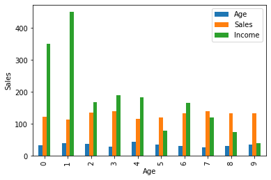

# Data Visualization

Source: https://www.geeksforgeeks.org/data-visualization-different-charts-python/

Data Visualization is the presentation of data in graphical format. It helps people understand the significance of data by summarizing and presenting huge amount of data in a simple and easy-to-understand format and helps communicate information clearly and effectively.

An important concept when we solve any data science or machine learning problem. Because every problem has to go through certain steps.

1. ​	Understand the Problem Statement
2. ​    Acquire Data & Cleaning
3. ​    Data Visualization / Exploratory Analysis
4. ​    Machine Learning Modelling
5. ​    Share Results/ Interesting Visualizations about findings.

So data visualizations comes in picture at two stages. 
-	Before Modelling, how data look like.
-	While sharing some result .

Different Types of Charts for Analyzing & Presenting Data

- Line Plot
- Scatter Plot
- Histogram
- Column Chart
- Pie Chart

### Line Plots

It is used to plot functions or equation. 

```python
import matplotlib.pyplot as plt
import numpy as np
# To plot a line
x= np.arange(100)
y= x**2+10
plt.plot(x,y)
```


### Scatter Plot
You get points here instead of line. It should be used when there are many different data points, and you want to highlight similarities in the data set. This is useful when looking for outliers and for understanding the distribution of your data.


```python
import numpy as np
import matplotlib.pyplot as plt
x = np.array([1,2,3,4,5,2.8])
y= x**2+3+x**4
plt.scatter(x, y, c ="blue") 
plt.show()
```


### Histogram

The histogram represents the frequency of occurrence of specific phenomena which lie within a specific range of values and arranged in consecutive and fixed intervals.

In below code histogram is plotted for `Age, Income, Sales`. So these plots in the output shows frequency of each unique value for each attribute.

BarGraph Representation


```python

# import pandas and matplotlib 
import pandas as pd 
import matplotlib.pyplot as plt 
  
# create 2D array of table given above 
data = [['E001', 'M', 34, 123, 'Normal', 350], 
        ['E002', 'F', 40, 114, 'Overweight', 450], 
        ['E003', 'F', 37, 135, 'Obesity', 169], 
        ['E004', 'M', 30, 139, 'Underweight', 189], 
        ['E005', 'F', 44, 117, 'Underweight', 183], 
        ['E006', 'M', 36, 121, 'Normal', 80], 
        ['E007', 'M', 32, 133, 'Obesity', 166], 
        ['E008', 'F', 26, 140, 'Normal', 120], 
        ['E009', 'M', 32, 133, 'Normal', 75], 
        ['E010', 'M', 36, 133, 'Underweight', 40] ] 
  
# dataframe created with 
# the above data array 
df = pd.DataFrame(data, columns = ['EMPID', 'Gender',  
                                    'Age', 'Sales', 
                                    'BMI', 'Income'] ) 
  
# create histogram for numeric data 
df.hist() 
  
# show plot 
plt.show()
```


    <Figure size 640x480 with 4 Axes>


### Column Chart
A column chart is used to show a comparison among different attributes


```python
df.plot.bar() 
  
# plot between 2 attributes 
plt.bar(df['Age'], df['Sales']) 
plt.xlabel("Age") 
plt.ylabel("Sales") 
plt.show() 
```





### Pie Chart
A circular statistical graph which is divided into slice to illustrate numerical proportion


```python
plt.pie(df['Age'], labels = {"A", "B", "C", 
                             "D", "E", "F", 
                             "G", "H", "I", "J"}, 
                               
autopct ='% 1.1f %%', shadow = True) 
plt.show() 
```


