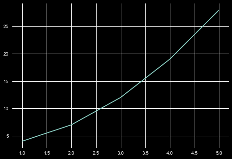
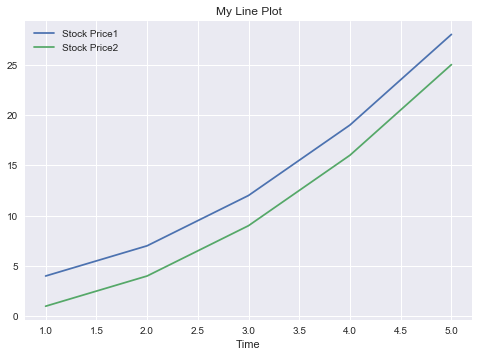
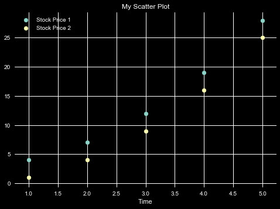
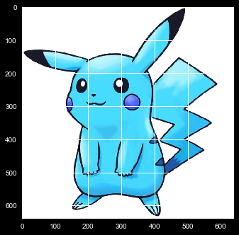
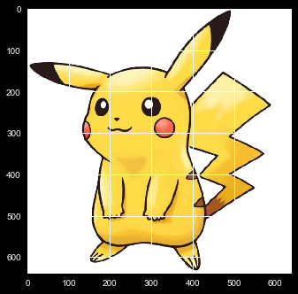

# Quick Start

# Python


## 1.Python Basic

Input In Python


```python
x=input()
```

    1


To Check Data Type of Variable


```python
print(type(x))
```

    <class 'str'>


```python
numbers = "1 2 3 4 5".split()
print(numbers)
```

    ['1', '2', '3', '4', '5']


```python
#TypeCasting List of Characters Into Numbers List 
numbers_list= [int(x) for x in numbers]
print(numbers_list)
```

    [1, 2, 3, 4, 5]


### Dictionaries(HASH-MAP)


```python
pokemon_map = {
    1 : "Pikachu",
    2 : "Bulbasur",
    3 : "Charmander"
}
print(pokemon_map[2])

```

    Bulbasur


```python
def printPokemons(numbers):
    pokemon_map = {
    1 : "Pikachu",
    2 : "Bulbasur",
    3 : "Charmander"
    }
    for i in range(numbers):
        if pokemon_map.get(i) is None:
            print("Invalid No")
        else:
            print(pokemon_map[i])
    return        
```


```python
numbers = int(input())
printPokemons(numbers)
```

    1
    Invalid No


```python
!pip install numpy
```

    Requirement already satisfied: numpy in c:\programdata\anaconda3\lib\site-packages (1.16.5)


## 2.Numpy


```python
import numpy as np
```


```python
#Few Important Functions
```


```python
a = np.array([1,2,3,4,5])
print(a)
```

    [1 2 3 4 5]


```python
print(type(a))
```

    <class 'numpy.ndarray'>


```python
a.shape
```


    (5,)


```python
b = np.array([[1,2,3,4],[5,6,7,8]])
print(b)
```

    [[1 2 3 4]
     [5 6 7 8]]


```python
b.shape
```


    (2, 4)


```python
print(b.shape)
```

    (2, 4)


```python
# Transpose Of Array
b.T
```


    array([[1, 5],
           [2, 6],
           [3, 7],
           [4, 8]])


```python
#Dot Product of b and transpose of b
np.dot(b,b.T)
```


    array([[ 30,  70],
           [ 70, 174]])


```python
#To know detail about any functions
#np.random.randint?
```


```python
np.random.randint(60,100,10)
```


    array([86, 81, 63, 99, 69, 72, 72, 95, 71, 61])


```python
matrix = np.random.randint(60,100,(5,5))
```


```python
print(matrix)
```

    [[77 92 75 84 87]
     [80 61 92 63 71]
     [74 89 76 77 84]
     [83 88 86 94 86]
     [84 68 76 89 60]]


```python
np.max(matrix)
```


    94


```python
np.min(matrix)
```


    60


```python
print(np.max(matrix))
print(np.min(matrix))
```

    94
    60


```python
#index of minimum element
a= np.array([0,1,-3,4,5,6])
np.argmin(a)
```


    2


```python
#index of maximum element
a= np.array([0,1,-3,4,5,6])
np.argmax(a)
```


    5


```python
#Unique element inside 
#Get in sorted order
np.unique(a)
```


    array([-3,  0,  1,  4,  5,  6])


```python
#Unique element inside 
#Get in sorted order
#count of element occurence
b = np.unique(a,return_counts=True)
print(b)
```

    (array([-3,  0,  1,  4,  5,  6]), array([1, 1, 1, 1, 1, 1], dtype=int64))


```python
#Program to find out the number with the highest frequency

x=np.array([1,0,-1,2,3,1,3,4,5,2,1])
print(b[0][np.argmax(b[1])])

```

    -3


```python
#Slicing Arrays
matrix
```


    array([[77, 92, 75, 84, 87],
           [80, 61, 92, 63, 71],
           [74, 89, 76, 77, 84],
           [83, 88, 86, 94, 86],
           [84, 68, 76, 89, 60]])


```python
matrix[2:4,1:3]
```


    array([[89, 76],
           [88, 86]])


```python
matrix[0][0]
```


    77


## 3.Data Visualisation


```python
#To install matplotlib module
!pip install matplotlib

#To see how the data look like, what kind of graph or plot it is.
```

    Requirement already satisfied: matplotlib in c:\programdata\anaconda3\lib\site-packages (3.1.1)
    Requirement already satisfied: cycler>=0.10 in c:\programdata\anaconda3\lib\site-packages (from matplotlib) (0.10.0)
    Requirement already satisfied: kiwisolver>=1.0.1 in c:\programdata\anaconda3\lib\site-packages (from matplotlib) (1.1.0)
    Requirement already satisfied: pyparsing!=2.0.4,!=2.1.2,!=2.1.6,>=2.0.1 in c:\programdata\anaconda3\lib\site-packages (from matplotlib) (2.4.2)
    Requirement already satisfied: python-dateutil>=2.1 in c:\programdata\anaconda3\lib\site-packages (from matplotlib) (2.8.0)
    Requirement already satisfied: numpy>=1.11 in c:\programdata\anaconda3\lib\site-packages (from matplotlib) (1.16.5)
    Requirement already satisfied: six in c:\programdata\anaconda3\lib\site-packages (from cycler>=0.10->matplotlib) (1.12.0)
    Requirement already satisfied: setuptools in c:\programdata\anaconda3\lib\site-packages (from kiwisolver>=1.0.1->matplotlib) (41.4.0)


```python
import matplotlib.pyplot as plt
```


```python
x = np.array([1,2,3,4,5])
y= x**2+3
```


```python
print(y)
```

    [ 4  7 12 19 28]


```python
print(x,y)
```

    [1 2 3 4 5] [ 4  7 12 19 28]


```python
#To Draw line chart
plt.plot(x,y)
```


    [<matplotlib.lines.Line2D at 0x1a10691c8c8>]





```python
# To see styles available
plt.style.available
```


    ['bmh',
     'classic',
     'dark_background',
     'fast',
     'fivethirtyeight',
     'ggplot',
     'grayscale',
     'seaborn-bright',
     'seaborn-colorblind',
     'seaborn-dark-palette',
     'seaborn-dark',
     'seaborn-darkgrid',
     'seaborn-deep',
     'seaborn-muted',
     'seaborn-notebook',
     'seaborn-paper',
     'seaborn-pastel',
     'seaborn-poster',
     'seaborn-talk',
     'seaborn-ticks',
     'seaborn-white',
     'seaborn-whitegrid',
     'seaborn',
     'Solarize_Light2',
     'tableau-colorblind10',
     '_classic_test']


```python
plt.style.use('seaborn')
plt.plot(x,y,label="Stock Price1")
plt.plot(x,x**2,label="Stock Price2")
plt.title("My Line Plot")
plt.xlabel("Price")
plt.xlabel("Time")
#label wont be seen if we dont use this
plt.legend()
plt.show()
```





```python
plt.style.use('dark_background')
plt.scatter(x,y,label="Stock Price 1")
plt.scatter(x,x**2,label="Stock Price 2")
plt.title("My Scatter Plot")
plt.xlabel("Price")
plt.xlabel("Time")
#label wont be seen if we dont use this
plt.legend()
plt.show()
```





## 4.OpenCV


```python
import cv2
import matplotlib.pyplot as plt
```


```python
#to install opencv
!pip install opencv-python
```

    Requirement already satisfied: opencv-python in c:\programdata\anaconda3\lib\site-packages (4.3.0.36)
    Requirement already satisfied: numpy>=1.14.5 in c:\programdata\anaconda3\lib\site-packages (from opencv-python) (1.16.5)


```python
#An RGB image have 3 channel 
#Each image is a matrix which is 3*3
images = cv2.imread('images/pikachu.jpg')
print(images)
```

    [[[255 255 255]
      [255 255 255]
      [255 255 255]
      ...
      [255 255 255]
      [255 255 255]
      [255 255 255]]
    
     [[255 255 255]
      [255 255 255]
      [255 255 255]
      ...
      [255 255 255]
      [255 255 255]
      [255 255 255]]
    
     [[255 255 255]
      [255 255 255]
      [255 255 255]
      ...
      [255 255 255]
      [255 255 255]
      [255 255 255]]
    
     ...
    
     [[255 255 255]
      [255 255 255]
      [255 255 255]
      ...
      [255 255 255]
      [255 255 255]
      [255 255 255]]
    
     [[255 255 255]
      [255 255 255]
      [255 255 255]
      ...
      [255 255 255]
      [255 255 255]
      [255 255 255]]
    
     [[255 255 255]
      [255 255 255]
      [255 255 255]
      ...
      [255 255 255]
      [255 255 255]
      [255 255 255]]]


```python
 print(images.shape)
```

    (640, 640, 3)


```python
#Shows the image in BGR Format
#First Channel as Blue then Green then Red
plt.imshow(images)
plt.show()
```





```python
#To Convert Color i.e from  BGR to RGB
rgb_image = cv2.cvtColor(images,cv2.COLOR_BGR2RGB)
plt.imshow(rgb_image)
plt.show()
```





```python
#To Turn off axis
#the axis method must be above show
plt.imshow(rgb_image)
plt.axis("off")
plt.show()
```


```python
#To crop a portion of image
crop_image=rgb_image[100:400,120:400,:]
plt.imshow(crop_image)
plt.axis("off")
plt.show()
```


```python
crop_image.shape
```


    (300, 280, 3)


```python
total_pixels= crop_image.shape[0]*crop_image.shape[1]
```


```python
#each pixels have 3 values so it will be a large value of int
print(total_pixels)
```

    84000


```python
#Resize the image
crop_image=cv2.resize(crop_image,(100,100))
plt.imshow(crop_image)
plt.title("Pikachu"+str(crop_image.shape))
plt.axis("off")
plt.show()
```


```python
crop_image.shape
```


    (100, 100, 3)


## 5.Pandas - Working with Tabular Data


```python
import numpy as np
```


```python
  pokemons = {
      "Height" : np.random.randint(1,100,5),
      "Weight" : np.random.randint(50,150,5),
      "Power"  : np.random.randint(220,350,5)
  }
```


```python
pokemons
```


    {'Height': array([15, 19, 17, 63, 67]),
     'Weight': array([114,  83, 116, 101, 119]),
     'Power': array([309, 229, 299, 326, 282])}


```python
import pandas as pd
```


```python
df = pd.DataFrame(pokemons)
print(df)
```

       Height  Weight  Power
    0      15     114    309
    1      19      83    229
    2      17     116    299
    3      63     101    326
    4      67     119    282


```python
df.head()
```


<div>
<style scoped>
    .dataframe tbody tr th:only-of-type {
        vertical-align: middle;
    }

    .dataframe tbody tr th {
        vertical-align: top;
    }
    
    .dataframe thead th {
        text-align: right;
    }
</style>
<table border="1" class="dataframe">
  <thead>
    <tr style="text-align: right;">
      <th></th>
      <th>Height</th>
      <th>Weight</th>
      <th>Power</th>
    </tr>
  </thead>
  <tbody>
    <tr>
      <td>0</td>
      <td>15</td>
      <td>114</td>
      <td>309</td>
    </tr>
    <tr>
      <td>1</td>
      <td>19</td>
      <td>83</td>
      <td>229</td>
    </tr>
    <tr>
      <td>2</td>
      <td>17</td>
      <td>116</td>
      <td>299</td>
    </tr>
    <tr>
      <td>3</td>
      <td>63</td>
      <td>101</td>
      <td>326</td>
    </tr>
    <tr>
      <td>4</td>
      <td>67</td>
      <td>119</td>
      <td>282</td>
    </tr>
  </tbody>
</table>
</div>


```python
df.head(n=3)
```


<div>
<style scoped>
    .dataframe tbody tr th:only-of-type {
        vertical-align: middle;
    }

    .dataframe tbody tr th {
        vertical-align: top;
    }
    
    .dataframe thead th {
        text-align: right;
    }
</style>
<table border="1" class="dataframe">
  <thead>
    <tr style="text-align: right;">
      <th></th>
      <th>Height</th>
      <th>Weight</th>
      <th>Power</th>
    </tr>
  </thead>
  <tbody>
    <tr>
      <td>0</td>
      <td>15</td>
      <td>114</td>
      <td>309</td>
    </tr>
    <tr>
      <td>1</td>
      <td>19</td>
      <td>83</td>
      <td>229</td>
    </tr>
    <tr>
      <td>2</td>
      <td>17</td>
      <td>116</td>
      <td>299</td>
    </tr>
  </tbody>
</table>
</div>


```python
print(df.columns)
```

    Index(['Height', 'Weight', 'Power'], dtype='object')


```python
#Create a CSV(Comma Seperated Value) Files
#to remove indexes or by default its true
df.to_csv('pokemon_data.csv',index=False)
```


```python
#Read a Data Frame
df=pd.read_csv('pokemon_data.csv')
```


```python
df.head()
```


<div>
<style scoped>
    .dataframe tbody tr th:only-of-type {
        vertical-align: middle;
    }

    .dataframe tbody tr th {
        vertical-align: top;
    }
    
    .dataframe thead th {
        text-align: right;
    }
</style>
<table border="1" class="dataframe">
  <thead>
    <tr style="text-align: right;">
      <th></th>
      <th>Height</th>
      <th>Weight</th>
      <th>Power</th>
    </tr>
  </thead>
  <tbody>
    <tr>
      <td>0</td>
      <td>15</td>
      <td>114</td>
      <td>309</td>
    </tr>
    <tr>
      <td>1</td>
      <td>19</td>
      <td>83</td>
      <td>229</td>
    </tr>
    <tr>
      <td>2</td>
      <td>17</td>
      <td>116</td>
      <td>299</td>
    </tr>
    <tr>
      <td>3</td>
      <td>63</td>
      <td>101</td>
      <td>326</td>
    </tr>
    <tr>
      <td>4</td>
      <td>67</td>
      <td>119</td>
      <td>282</td>
    </tr>
  </tbody>
</table>
</div>


```python
df.shape
```


    (5, 3)


```python

```
